# TaskFlow Developer Documentation

This document is the developer-facing architecture reference for `todo-ui`.

It is meant for:

- engineers onboarding into the project
- contributors extending features safely
- reviewers who want to understand data flow quickly
- teammates who need the system view before reading code

For beginner-oriented material, use:

- [README.md](./README.md)
- [BEGINNER_BUILD_GUIDE.md](./BEGINNER_BUILD_GUIDE.md)
- [BEGINNER_COPY_PASTE_PLAYBOOK.md](./BEGINNER_COPY_PASTE_PLAYBOOK.md)
- [PWA_LEARNING_PLAN_PLAYBOOK.md](./PWA_LEARNING_PLAN_PLAYBOOK.md)
- [PWA_THEORY_FUNDAMENTALS_PLAYBOOK.md](./PWA_THEORY_FUNDAMENTALS_PLAYBOOK.md)

## 1. Executive Summary

TaskFlow is a React + TypeScript offline-first task manager PWA with:

- backend auth
- protected routing
- task CRUD over RTK Query
- IndexedDB-backed offline cache
- offline mutation queue
- sync through `POST /sync`
- conflict handling
- install/update PWA support
- browser push subscription support

The project intentionally separates:

- app shell caching in the service worker
- authenticated task data in IndexedDB
- server communication in RTK Query
- session state in Redux

That separation is one of the most important design decisions in this codebase.

## 2. System Overview

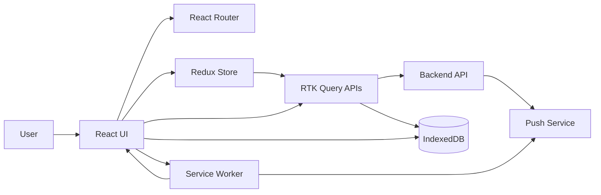

## 3. Architectural Principles

### 3.1 Offline-First, Not Service-Worker-Only

This app does not treat the service worker as the source of truth for task
data.

Instead:

- the service worker caches shell/static assets
- IndexedDB stores task data and pending operations
- React app logic decides how cached and live data are presented

### 3.2 Honest State Presentation

The UI should tell the user what kind of data is currently visible.

Examples:

- fresh backend data
- cached snapshot
- offline cached snapshot
- local pending changes
- refreshing latest data

This prevents offline-first behavior from looking like a bug.

### 3.3 Safe Multi-User Boundaries

Protected API responses are not blindly cached in the service worker.

Why:

- user A must not see user B data after logout/login
- stale protected API responses are hard to reason about
- IndexedDB cleanup is easier to control explicitly

### 3.4 Coordination Over Premature Abstraction

`src/App.tsx` is still the main coordinator for task flow. That is intentional.

Business rules that deserved extraction were moved into:

- `features/auth`
- `features/tasks`
- `features/offline`
- `features/sync`
- `features/notifications`
- `pwa`

## 4. Source Tree Map

```text
src/
  app/
    hooks.ts
    store.ts
  components/
    AnalyticsPanel.tsx
    AppIcons.tsx
    ConflictModal.tsx
    LoginView.tsx
    NotificationSettings.tsx
    OnlineIndicator.tsx
    RegisterView.tsx
    TaskCard.tsx
    TaskBoard.tsx
    TaskModal.tsx
  features/
    api/
      baseApi.ts
    auth/
      authApi.ts
      authSlice.ts
      authTypes.ts
    notifications/
      notificationTypes.ts
      notificationsApi.ts
      pushUtils.ts
      usePushNotifications.ts
    offline/
      indexedDb.ts
      offlineTypes.ts
      syncMeta.ts
      syncQueue.ts
      taskCache.ts
    sync/
      conflictManager.ts
      syncApi.ts
      syncManager.ts
      syncTypes.ts
      useSync.ts
    tasks/
      taskTypes.ts
      tasksApi.ts
  hooks/
    useOnlineStatus.ts
  layouts/
    AppLayout.tsx
    AuthLayout.tsx
  lib/
    env.ts
    storage.ts
  pages/
    app/
    auth/
    not-found/
  pwa/
    InstallPrompt.tsx
    PwaUpdatePrompt.tsx
    pwaRegistration.ts
    useInstallPrompt.ts
  routes/
    AppRouter.tsx
    ProtectedRoute.tsx
    routeTypes.ts
  types/
    api.ts
  utils/
    db.ts
public/
  _redirects
  pwa-192x192.png
  pwa-512x512.png
  pwa-maskable-512x512.png
  pwa-maskable-icon.svg
```

## 5. Runtime Ownership Model

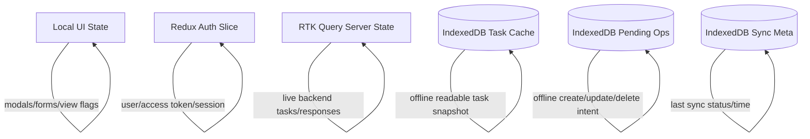

## 6. Routing Model

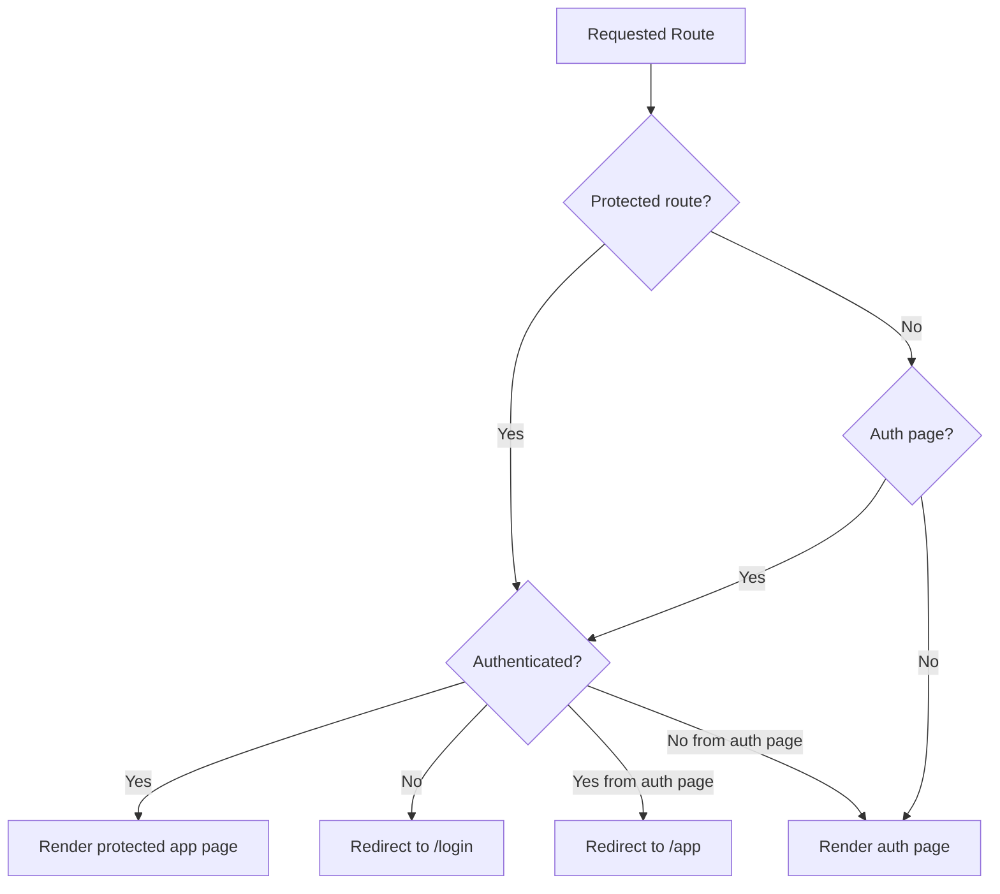

Primary routes:

- `/login`
- `/register`
- `/app`
- `/app/tasks`
- `/app/tasks/new`
- `/app/tasks/:taskId`
- `/app/profile`

Key files:

- [src/routes/AppRouter.tsx](./src/routes/AppRouter.tsx)
- [src/routes/ProtectedRoute.tsx](./src/routes/ProtectedRoute.tsx)
- [src/layouts/AuthLayout.tsx](./src/layouts/AuthLayout.tsx)
- [src/layouts/AppLayout.tsx](./src/layouts/AppLayout.tsx)

## 7. Authentication Architecture

### 7.1 Components

- `authSlice.ts` holds authenticated session state
- `authApi.ts` exposes backend auth endpoints
- `storage.ts` persists/restores auth session
- `baseApi.ts` injects bearer token into protected requests

### 7.2 Auth Sequence

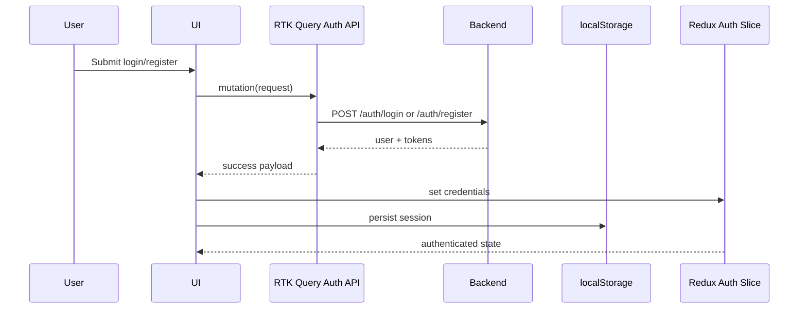

### 7.3 Logout Requirements

On logout the app must:

- call backend logout when possible
- clear persisted auth data
- reset in-memory auth state
- clear user-scoped local cached data

This avoids older-user data leaking into a newer session.

## 8. API Layer

All backend communication goes through RTK Query APIs built on top of:

- [src/features/api/baseApi.ts](./src/features/api/baseApi.ts)

Responsibilities of `baseApi.ts`:

- central base URL
- auth header injection
- shared tag definitions
- shared API behavior surface

Feature APIs:

- `authApi.ts`
- `tasksApi.ts`
- `syncApi.ts`
- `notificationsApi.ts`

## 9. Task Data Architecture

### 9.1 Live Data Path

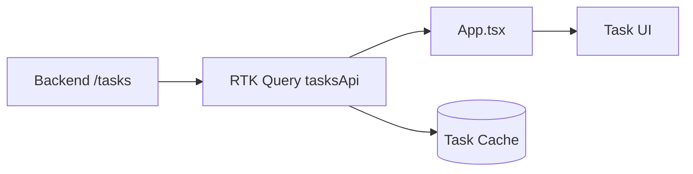

### 9.2 Task Query Responsibilities

`tasksApi.ts` handles:

- fetch task list
- fetch task details
- create task
- update task
- delete task
- query params like page, limit, search, sort

The current UI intentionally exposes:

- search
- sort
- pagination

It does not currently expose all possible backend filters.

## 10. Cache-First Read Strategy

The app uses a cache-first/stale-while-revalidate style for task reads.

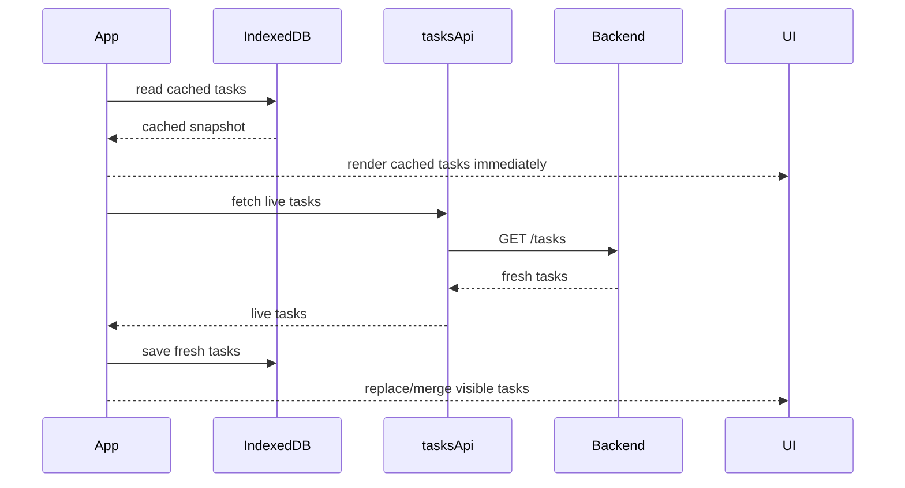

Why:

- faster perceived load
- better offline behavior
- better installed-PWA experience

## 11. Offline Persistence Design

### 11.1 IndexedDB Stores

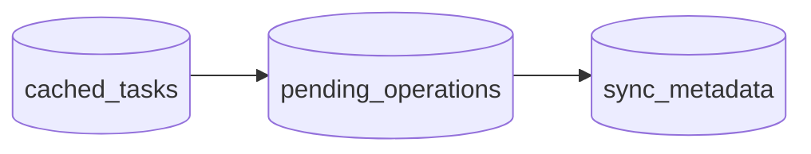

Logical groups:

- cached tasks
- pending offline operations
- sync metadata

Key files:

- [src/features/offline/indexedDb.ts](./src/features/offline/indexedDb.ts)
- [src/features/offline/taskCache.ts](./src/features/offline/taskCache.ts)
- [src/features/offline/syncQueue.ts](./src/features/offline/syncQueue.ts)
- [src/features/offline/syncMeta.ts](./src/features/offline/syncMeta.ts)

### 11.2 Why IndexedDB

IndexedDB is used instead of `localStorage` for task data because:

- it is better for structured records
- it scales better
- it is asynchronous
- it is safer for queue-like offline state

## 12. Offline Mutation Model

When offline, task actions do not just fail. They are transformed into:

- local cache updates
- queued operations for later sync

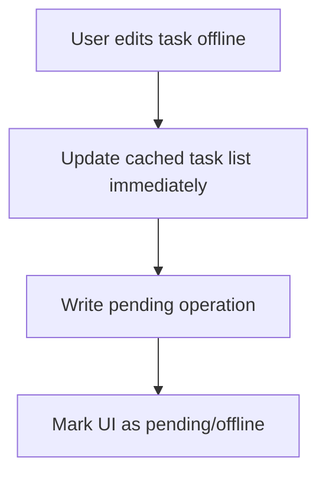

Supported offline behaviors:

- create
- edit
- delete
- status toggle

Important details:

- create uses a temporary client id locally
- update stores client-updated time and version context if available
- delete is soft-removed locally before real backend reconciliation

## 13. Sync Architecture

### 13.1 Sync Components

- `syncApi.ts`
- `syncManager.ts`
- `useSync.ts`
- `conflictManager.ts`

### 13.2 Sync Sequence

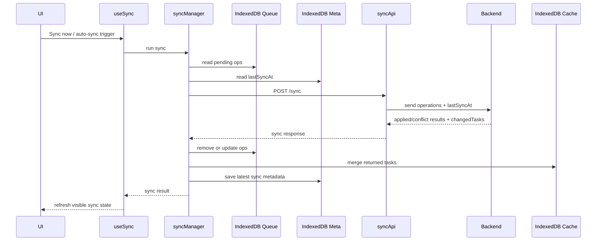

### 13.3 Post-Sync Refresh Protection

One important stabilization layer exists after sync:

- the app keeps showing synced cached state
- then performs the follow-up live backend refetch
- only after that fetch settles does the UI fully hand back to live results

Why:

- prevents temporary disappearing tasks
- avoids unstable task ordering on slower devices
- improves PWA/mobile reliability

## 14. Conflict Handling

Conflicts are not treated as generic failures.

They are treated as explicit user-visible state.

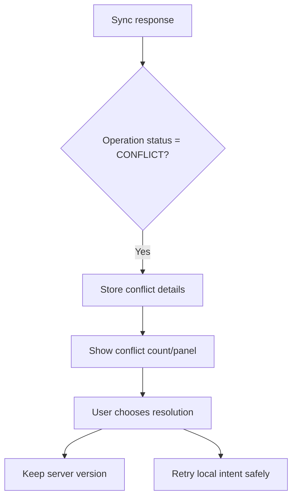

Conflict goals:

- no silent data loss
- user can inspect local intent vs server state
- conflict can be resolved safely

## 15. PWA Architecture

### 15.1 PWA Components

- [vite.config.ts](./vite.config.ts)
- [src/sw.ts](./src/sw.ts)
- [src/pwa/pwaRegistration.ts](./src/pwa/pwaRegistration.ts)
- [src/pwa/InstallPrompt.tsx](./src/pwa/InstallPrompt.tsx)
- [src/pwa/PwaUpdatePrompt.tsx](./src/pwa/PwaUpdatePrompt.tsx)
- [src/pwa/useInstallPrompt.ts](./src/pwa/useInstallPrompt.ts)

### 15.2 PWA Runtime Model

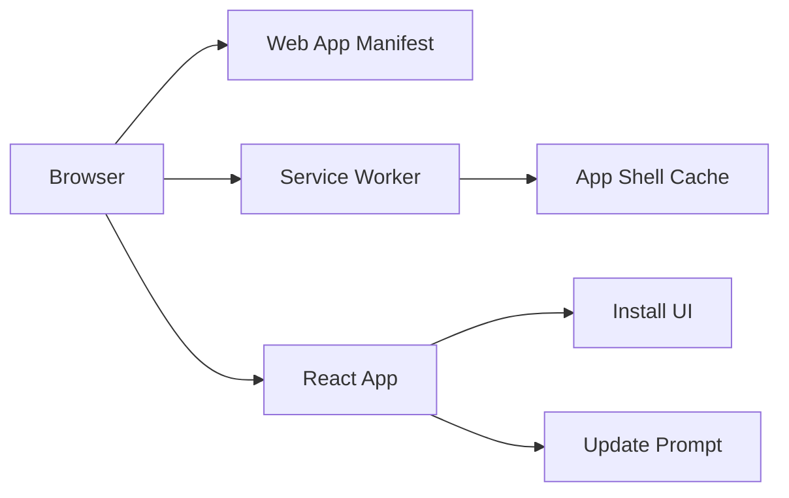

### 15.3 Service Worker Scope

The service worker is responsible for:

- shell/static asset caching
- installability support
- update lifecycle

It is not the authority for:

- authenticated task records
- offline mutation queue
- conflict state

Those belong to app-managed IndexedDB logic.

## 16. Install Flow

Browsers do not expose install behavior uniformly.

The app therefore supports:

- direct browser install prompt when available
- manual install guidance when prompt is not available

This matters especially for:

- Android Chrome variations
- iPhone/iPad Safari home-screen flow

## 17. Push Notification Architecture

### 17.1 Push Components

- [src/features/notifications/notificationTypes.ts](./src/features/notifications/notificationTypes.ts)
- [src/features/notifications/notificationsApi.ts](./src/features/notifications/notificationsApi.ts)
- [src/features/notifications/pushUtils.ts](./src/features/notifications/pushUtils.ts)
- [src/features/notifications/usePushNotifications.ts](./src/features/notifications/usePushNotifications.ts)
- [src/sw.ts](./src/sw.ts)

### 17.2 Push Delivery Flow

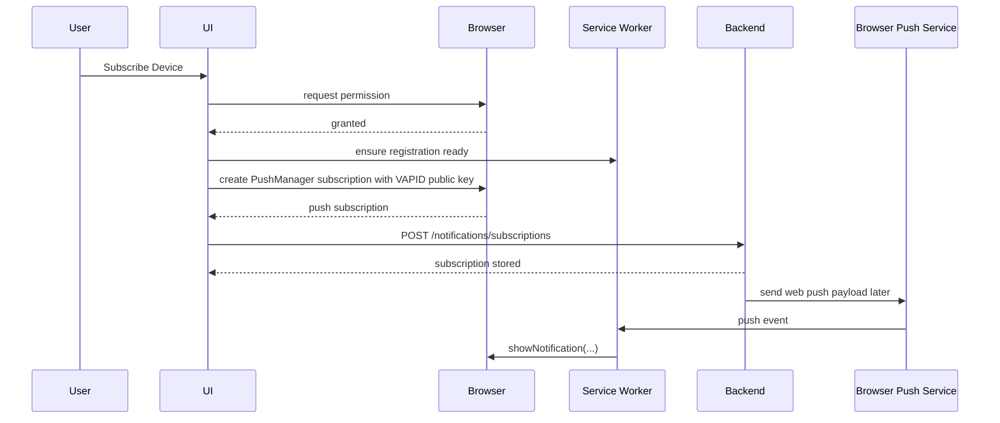

### 17.3 Practical Notes

- permission granted alone is not enough
- backend saving subscription alone is not enough
- backend send success alone is not enough
- the service worker in `src/sw.ts` must actually receive and display the notification

## 18. Environment and Configuration

Required environment variables:

```env
VITE_API_BASE_URL=http://localhost:3000
VITE_VAPID_PUBLIC_KEY=your_public_key_here
```

Meanings:

- `VITE_API_BASE_URL`
  Base URL for auth, tasks, sync, notifications
- `VITE_VAPID_PUBLIC_KEY`
  Public push key used by the browser subscription flow

## 19. Operational Expectations

### Development

Use:

```bash
npm run dev
```

For:

- normal UI iteration
- non-service-worker feature work

### Production-Like Validation

Use:

```bash
npm run build
npm run preview
```

For:

- install flow verification
- service worker behavior
- push notification verification
- update prompt validation

## 20. Observability and Troubleshooting

When debugging, inspect:

- Network tab for auth, task, sync, notification requests
- Application tab for IndexedDB contents
- Application tab for service worker registration state
- notification permission state
- pending queue count and sync state in the UI

Frequent failure classes:

- expired or missing auth token
- stale user-scoped local data after session changes
- service worker not active/ready
- push subscription not created or not persisted
- browser/platform install limitations mistaken for app bugs

## 21. Extension Guidelines

If extending this project:

- keep protected API data out of blind SW caching
- keep storage logic outside view components
- preserve explicit data-source labeling
- preserve logout cleanup guarantees
- prefer feature modules over bloating `App.tsx`
- test offline and mobile behavior, not just desktop happy path

Good candidates for future improvement:

- route-level code splitting
- deeper task details experience
- richer conflict resolution UX
- multi-account/user namespace hardening in local stores
- broader automated testing around sync/offline flows

## 22. Known Constraints

- Dark-only theme is currently intentional for visual consistency.
- Task board UI intentionally exposes only the filters that are fully wired.
- Push support remains browser/platform dependent.
- Install UX remains browser/platform dependent.
- `App.tsx` is still a coordinator-heavy file by design, though core data logic
  has been extracted around it.

## 23. Credits

Author:

- Marjan Hasan Moon
- GitHub: `https://github.com/marjanhasan05`
- LinkedIn: `https://www.linkedin.com/in/marjanhasan/`

Backend developer:

- Arifur Rahman
- LinkedIn: `https://www.linkedin.com/in/arifur-rahman223`
- GitHub: `https://github.com/arif1101`

Backend repository:

- `https://github.com/marjanhasan05/to-do-backend`
